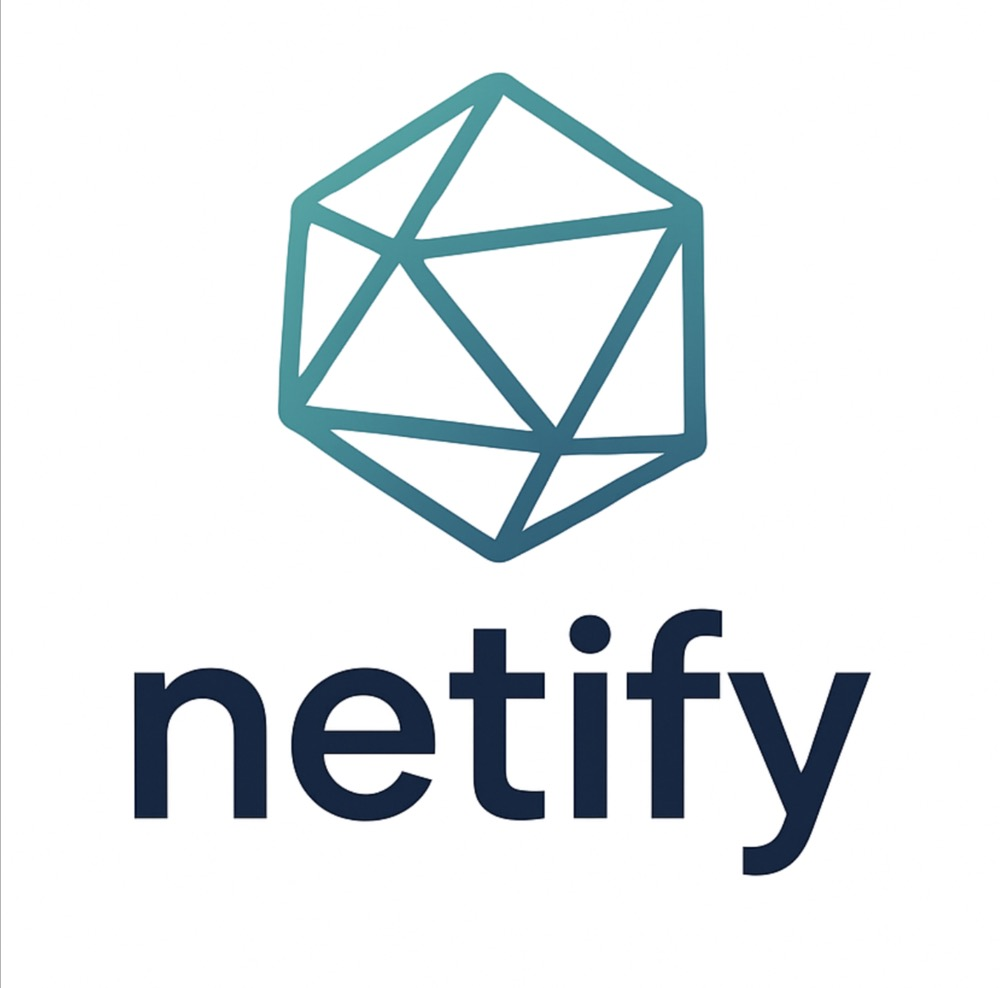
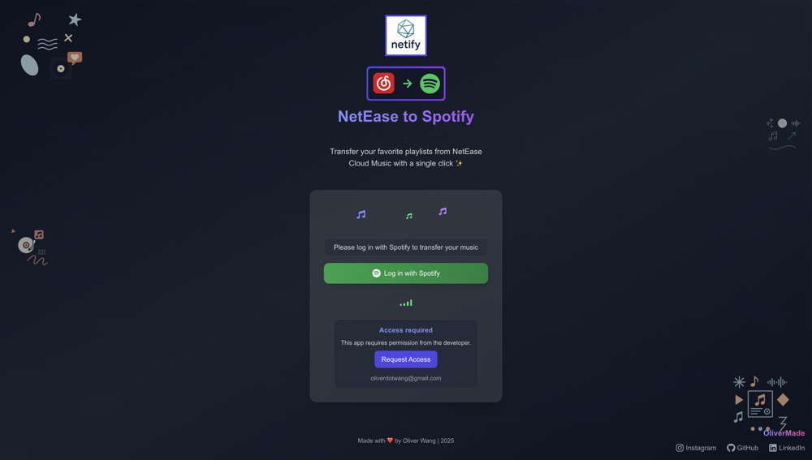
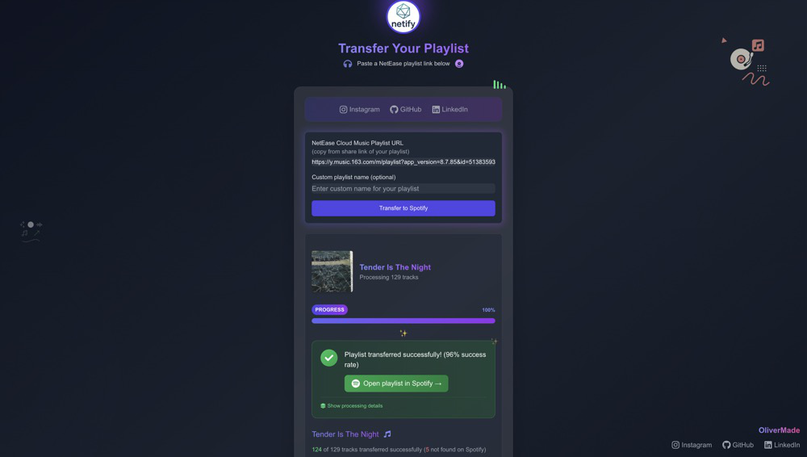

# Netify: Transfer NetEase Cloud Music playlists to Spotify 🎧
# 网易云音乐歌单迁移至Spotify工具 🎧

> [简体中文](README_CN.md) | English

<div align="center">
  
  <br/>
  <p>
    <a href="https://netify-five.vercel.app/" target="_blank"><strong>🚀 Try it now</strong></a>
  </p>
</div>

<hr/>

## 🌟 Features

- **Simple One-Click Process**: Just log in with Spotify, paste a NetEase playlist link, and click Transfer
- **Full Playlist Import**: Transfer entire playlists including tracks, name, and cover art
- **Smart Matching**: Advanced algorithm to find the best matches on Spotify
- **Large Playlist Support**: Can handle up to 10,000 tracks
- **Progress Tracking**: See detailed progress as your music transfers
- **Missing Tracks Report**: Get a detailed report of any songs that couldn't be found

## 🌟 特点

- **一键式流程**：只需用Spotify登录，粘贴网易云歌单链接，点击转移即可
- **完整歌单导入**：转移整个歌单，包括歌曲、名称和封面
- **智能匹配**：先进的算法在Spotify上找到最佳匹配
- **大型歌单支持**：可处理多达10,000首歌曲
- **进度追踪**：查看音乐传输的详细进度
- **缺失歌曲报告**：获取无法找到的歌曲的详细报告

<hr/>

## 📱 Demo

<div align="center">
  <table>
    <tr>
      <td align="center">
        
        <br/>
        <em>Home Screen</em>
      </td>
      <td align="center">
        
        <br/>
        <em>Transfer Process</em>
      </td>
    </tr>
  </table>
</div>


## 🔍 How to use

1. Visit [Netify Web App](https://netify-five.vercel.app/) and click **Log in with Spotify**
2. Authorize the application (requires Spotify account which is the email you use)
3. Copy a NetEase Cloud Music playlist link, for example:
   ```
   https://y.music.163.com/m/playlist?id=123456
   ```
4. Paste the link into the input box and click **Transfer to Spotify**
5. Wait for the process to complete - you'll see a progress bar
6. When finished, click "Open playlist in Spotify" to view your new playlist

<hr/>

## 🛠️ Technology Stack

- **Frontend**: Next.js 14, Tailwind CSS, React
- **Backend**: FastAPI (Python), hosted on Fly.io
- **APIs**: Spotify Web API, NetEase Cloud Music API
- **Deployment**: Vercel (frontend), Fly.io (backend)

## 💻 Development

### Prerequisites

1. Node.js 18+ for the frontend
2. Python 3.9+ for the backend API
3. A Spotify Developer account and registered application

### Environment Setup

Create a `.env.local` file in the root directory:
```
NEXT_PUBLIC_BACKEND_URL=http://localhost:8080
NEXT_PUBLIC_SPOTIFY_CLIENT_ID=your_spotify_client_id
NEXT_PUBLIC_SPOTIFY_REDIRECT_URI=http://localhost:3000/callback
```

For the backend, create a `.env` file in the `api` directory:
```
SPOTIFY_CLIENT_ID=your_spotify_client_id
SPOTIFY_CLIENT_SECRET=your_spotify_client_secret
SPOTIFY_REDIRECT_URI=http://localhost:3000/callback
```

### Running Locally

Frontend:
```bash
# Install frontend dependencies
npm install

# Run the frontend
npm run dev
```

Backend:
```bash
# Create a virtual environment
python -m venv .venv
source .venv/bin/activate  # On Windows: .venv\Scripts\activate

# Install backend dependencies
cd api
pip install -r requirements.txt

# Run the backend
uvicorn backend.main:app --reload --port 8080
```

Open [http://localhost:3000](http://localhost:3000) in your browser.

## 🚀 Deployment

### Frontend (Vercel)

1. Push your code to a GitHub repository
2. Import the project in Vercel
3. Add the necessary environment variables:
   - `NEXT_PUBLIC_BACKEND_URL`: URL of your deployed backend API
   - `NEXT_PUBLIC_SPOTIFY_CLIENT_ID`: Your Spotify app's client ID
   - `NEXT_PUBLIC_SPOTIFY_REDIRECT_URI`: Your deployed app's callback URL

### Backend (Fly.io)

1. Install the [Fly.io CLI](https://fly.io/docs/hands-on/install-flyctl/)
2. Log in to Fly.io: `flyctl auth login`
3. Deploy the API:
   ```bash
   flyctl deploy
   ```
4. Set environment secrets:
   ```bash
   flyctl secrets set SPOTIFY_CLIENT_ID=your_client_id
   flyctl secrets set SPOTIFY_CLIENT_SECRET=your_client_secret
   flyctl secrets set SPOTIFY_REDIRECT_URI=https://your-deployed-frontend.com/callback
   ```

## 📝 License

This project is [MIT licensed](LICENSE).
